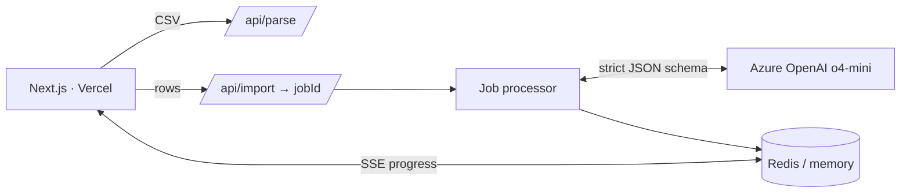

<div align="center">

# GrowEasy CSV Importer

[](https://grow-easy-harshitha.vercel.app/)

<br/>

[](https://grow-easy-harshitha.vercel.app/)

<br/>


<br/>

Upload a lead export in **any format** — different column names, layouts, languages.
The AI maps everything into 15 standardized GrowEasy CRM fields. No templates, no configuration.

</div>

<br/>

## How it works

```
Upload  →  Preview & edit  →  Confirm  →  AI extraction  →  Results
```

|  | Step | What happens |
|---|---|---|
| 1 | **Upload** | Drag & drop any `.csv` — up to 10 MB / 5,000 rows |
| 2 | **Preview** | Virtualized table, searchable, **editable inline** — no AI yet |
| 3 | **Confirm** | A background job starts (`jobId` returned instantly); batches of 20, 3 concurrent, retry with backoff |
| 4 | **Results** | Records + skipped rows with reasons, live stats, filters, inline editing, CSV export, fix-and-retry |

<br/>

## Architecture



The import runs **server-side, decoupled from the browser** — reload the page and it resumes; restart the server (with `REDIS_URL`) and a startup sweep re-runs only the unfinished batches. Multiple imports run in parallel, tracked live in the sidebar.

<br/>

## The AI layer

> The model maps. The server decides. No AI output reaches the CRM unvalidated.

| Rule | Enforcement |
|---|---|
| `crm_status` — 4 allowed values | mapped by meaning, re-validated server-side |
| `data_source` — 5 allowed values or blank | mapped confidently, re-validated server-side |
| `created_at` parseable by `new Date()` | verified server-side; failures preserved in `crm_note` |
| multiple emails / phones | first used, rest appended to `crm_note` |
| no email **and** no phone | row skipped, with reason |
| output shape | OpenAI structured outputs — strict JSON schema |

**Column-mapping transparency** — a parallel AI call reports how each CSV column was interpreted (`"Ph. Number" → mobile_without_country_code`), shown in the results view.

<br/>

## Features

|  |  |
|---|---|
| Resumable import jobs | survive reloads; with Redis, server restarts too |
| Virtualized tables | 5,000 rows scroll smoothly, sticky headers |
| Inline editing | fix raw data before AI, or records after — enums become dropdowns |
| Fix-and-retry | edit skipped rows in place, re-run only them; combined result marked `edited` |
| Search + filters | full-text search on both tables; status/source filters post-AI |
| Import history | localStorage, no login — live pending %, re-openable results |
| Motion design | spring physics, staggered reveals, count-up stats — respects `prefers-reduced-motion` |
| Dark mode | true-black theme, persisted toggle |

<br/>

## API

| Method | Path | Returns |
|---|---|---|
| `POST` | `/api/parse` | `{ headers, rows, totalRows }` — no AI |
| `POST` | `/api/import` | `202 { jobId }` — starts background job |
| `GET` | `/api/import/:id/stream` | SSE — `progress` · `done` · `fatal` · `not_found` |
| `GET` | `/api/import/:id` | JSON job snapshot |
| `GET` | `/health` | health + AI config status |

<br/>

## Quick start

```bash
# backend                                # frontend (new terminal)
cd backend                               cd frontend
npm install                              npm install
cp .env.example .env                     cp .env.example .env.local
npm run dev   # :4000                    npm run dev   # :3000
```

Add your Azure OpenAI credentials to `backend/.env`, then try the sample files in [`samples/`](samples/).

<details>
<summary><b>Environment variables</b></summary>
<br/>

```bash
PORT=4000
CORS_ORIGINS=http://localhost:3000            # comma-separated
AZURE_OPENAI_API_KEY=...
AZURE_OPENAI_ENDPOINT=https://....openai.azure.com/
AZURE_DEPLOYMENT=o4-mini
AZURE_OPENAI_API_VERSION=2025-01-01-preview
BATCH_SIZE=20
MAX_CONCURRENT_BATCHES=3
MAX_RETRIES=3
REDIS_URL=                                    # optional — restart-proof jobs (Upstash)
JOB_TTL_SECONDS=3600
```
</details>

<details>
<summary><b>Tests · Docker · Deployment</b></summary>
<br/>

```bash
cd backend && npm test        # 17 unit tests — parser edge cases + every CRM rule
```

```bash
AZURE_OPENAI_API_KEY=... AZURE_OPENAI_ENDPOINT=https://... docker compose up --build
```

| Piece | Platform | Config |
|---|---|---|
| Frontend | [Vercel](https://grow-easy-harshitha.vercel.app/) | root `frontend/` · env `NEXT_PUBLIC_API_URL` |
| Backend | Render / Railway | root `backend/` · `npm install && npm run build` · `npm start` |
</details>

<details>
<summary><b>Project structure</b></summary>
<br/>

```
backend/src/
  routes/ controllers/            /api/parse · /api/import · SSE
  services/
    csvParser.ts                  tolerant parsing — BOM, ragged rows, dup headers
    aiExtractor.ts                batching · structured outputs · retry
    validator.ts                  server-side rule enforcement
    jobProcessor.ts jobStore.ts   resumable jobs — Redis / in-memory
  prompts/extraction.ts           ★ the extraction + mapping prompts
frontend/src/
  app/page.tsx                    4-step wizard + sidebar history
  components/                     dropzone · virtualized tables · results
  hooks/useImport.ts              wizard state machine
samples/                          messy sample CSVs to demo with
```
</details>

<br/>

---

<div align="center">
<sub>Built for the GrowEasy Software Developer Assignment · <a href="https://grow-easy-harshitha.vercel.app/">try it live</a></sub>
</div>
